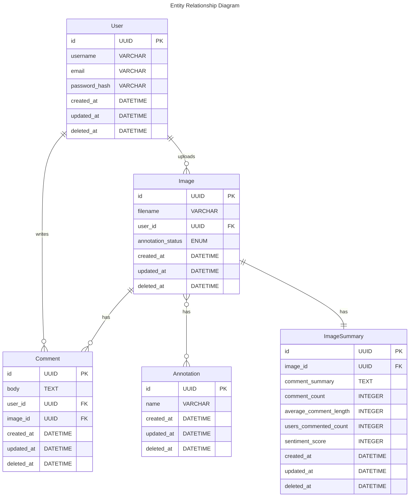

# practise-image-annotation-service-poc
This is a Proof of Concept (PoC) Flask application of an “Image Annotation Service” where users can perform all the basic actions in order to upload an image and have it annotated.

## Entity Relationship Diagram

The Entity Relationship Diagram (ERD) provided below illustrates the structure of the database schema used in the application. It outlines the relationships between different entities such as User, Image, Comment, Annotation, and ImageSummary. The ERD serves as a visual representation of how data is organized and related within the database.



## Swagger Documentation

Swagger has been integrated into the application to provide a comprehensive documentation of the available endpoints and their functionalities. Swagger is a powerful tool for designing, building, and documenting APIs with ease.

### Accessing Swagger Documentation

When the application is running, Swagger documentation can be accessed at the following endpoint: 

```plaintext
http://localhost:5000/apidocs/
```
## Tools and Frameworks

### Flask
[Flask](https://flask.palletsprojects.com/en/2.1.x/) is a lightweight WSGI web application framework in Python, offering tools, libraries, and patterns for building scalable web applications.

### ORM - SQLAlchemy
[SQLAlchemy](https://www.sqlalchemy.org/) is an open-source SQL toolkit and Object-Relational Mapping (ORM) library for Python. It provides a comprehensive suite of enterprise-level persistence patterns and an efficient SQL expression language.

### JSON Web Tokens (JWT)
JSON Web Tokens (JWT) are utilized for authentication and authorization purposes in the application. Custom decorators encapsulate JWT processing logic, enhancing code readability and maintainability by separating authentication concerns from endpoint implementations.

### Serialization and Validation - Marshmallow
[Marshmallow](https://marshmallow.readthedocs.io/en/stable/) is employed for data serialization, validation, and security. It ensures proper formatting, validation, and sanitization of data exchanged between the application and clients, enhancing robustness and security.

### Database - PostgreSQL
[PostgreSQL](https://www.postgresql.org/) is a powerful open-source object-relational database system known for its reliability, robustness, and support for advanced features such as multi-version concurrency control (MVCC) and table inheritance.

### Containerization and Orchestration - Docker and Docker Compose
[Docker](https://www.docker.com/) and [Docker Compose](https://docs.docker.com/compose/) simplify deployment and orchestration by containerizing the Flask application and PostgreSQL database. The Docker Compose file automates the setup of the entire system, streamlining deployment and ensuring convenient orchestration of services.

### Migrations - Alembic
[Alembic](https://alembic.sqlalchemy.org/en/latest/) is used for database migrations in conjunction with SQLAlchemy, facilitating the creation and management of database schema changes over time.

### Natural Language Processing - NLTK and TextBlob
[NLTK](https://www.nltk.org/) and [TextBlob](https://textblob.readthedocs.io/en/dev/) are Python libraries for natural language processing tasks such as tokenization, part-of-speech tagging, sentiment analysis, and more, enhancing the application's text processing capabilities.

### Automated Testing - Pytest
[Pytest](https://docs.pytest.org/en/stable/) is a powerful Python testing tool used for writing and executing automated tests. It promotes test-driven development practices, ensuring the reliability and quality of the application's codebase.

### Diagrams - Mermaid
[Mermaid](https://mermaid-js.github.io/mermaid/#/), a Markdown-like script language, was utilized for creating the Entity Relationship Diagram (ERD). Mermaid offers a simple syntax for generating diagrams directly within Markdown documents, facilitating the visualization of complex data structures and relationships with ease.

### Documentation - Swagger
[Swagger](https://swagger.io/) has been integrated into the application to provide a comprehensive documentation of the available endpoints and their functionalities. It allows developers to visualize, interact with, and test the API endpoints directly from the Swagger UI. This facilitates better understanding and utilization of the API, enhancing the overall development and testing process.


## System Design and Patterns

### Repository Pattern
The Repository Pattern is used as an abstraction layer that separates the logic that retrieves data from the database from the business logic in the application. This pattern ensures that only the repositories perform operations on the ORM models and handle the database session, preventing direct manipulation of the database session outside the repository. This separation of concerns enhances maintainability, testability, and scalability of the application.

### Singleton Pattern
The Singleton Pattern is employed for common services and utility methods, ensuring that all parts of the application can access and use the same resources correctly configured anywhere in the codebase. By enforcing a single instance of these resources throughout the application, this pattern promotes consistency, reduces resource consumption, and simplifies resource management.

### Endpoint Security with JWT
JSON Web Token (JWT) is utilized to secure the endpoints of the application. JWT is a stateless authentication mechanism that generates tokens containing user claims, which are then used to authenticate and authorize requests. By leveraging JWT, the application ensures secure communication between clients and the server, mitigating risks associated with traditional session-based authentication methods.

## Deployment and Execution

### Prerequisites
Ensure that Docker and Docker Compose are installed on your system.

### Deployment Steps
1. Clone the repository to your local machine:
   `git clone <repository_url>`

2. Navigate to the project directory:
```plaintext
cd <project_directory>
```
3. Run Docker Compose to set up the application:
```plaintext
docker-compose up
```

4. Docker Compose will initialize PostgreSQL, create the required database, and start the Flask application.

5. During initialization, the Flask application downloads necessary NLP models, establishes connections, initializes services, and creates an admin user in the database.

6. If the database is empty, two dummy annotations are automatically added to seed the database.

7. Once the setup is complete, you can start using the endpoints or visit the Swagger documentation page to explore the available endpoints and their functionalities.

### Accessing the Application

To perform any action on the application, you need to obtain a token by visiting the following endpoint:

```plaintext
http://127.0.0.1:5000/user/login
```
Provide the following credentials to obtain a bearer token:
```plaintext
username: admin
password: password
```
After providing the credentials, you will receive a bearer token, which you must use in all your requests to authenticate.
For example to use the token with Postman, follow these steps:

1. Open Postman and create a new request for the desired endpoint of the Flask application.
2. In the request headers, add an authorization header with the value "Bearer <token>", replacing "<token>" with the token obtained from the previous step.
3. Send the request to the Flask application endpoint. The application will authenticate the request using the provided token and respond accordingly.

For more information on how to use Postman, you can visit the [Postman website](https://www.postman.com/).


## Continuous Integration (CI)

### GitHub Pipeline
A Continuous Integration (CI) pipeline has been set up using GitHub Actions. This pipeline automates the execution of unit and integration tests whenever changes are pushed to the repository. 

### Test Automation
The CI pipeline ensures that all tests, including unit tests and integration tests, are automatically run to validate the integrity and functionality of the application. Any failures or issues are reported back to the developers for prompt resolution.

### Workflow Status Badge
The GitHub pipeline also generates a workflow status badge, which reflects the current status of the application based on the outcome of the tests. This badge provides visibility into the health and stability of the application directly from the GitHub repository page.
