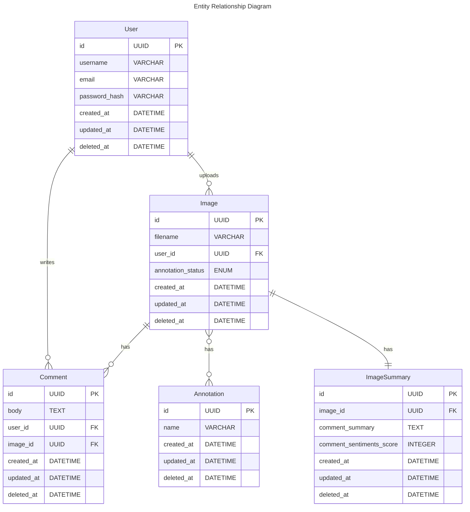

# practise-image-annotation-service-poc
This is a Proof of Concept (PoC) application of an “Image Annotation Service” where users can perform all the basic actions in order to upload an image and have it annotated.

